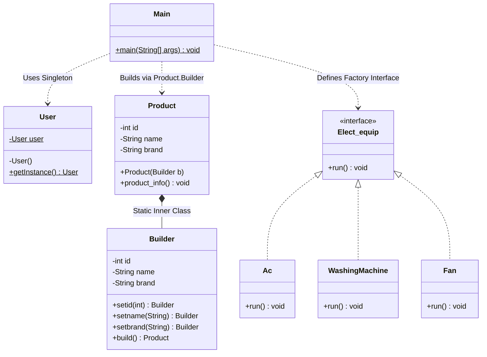

# Creational Design Patterns & Project Amazon

This repository contains demonstrations of three fundamental **Creational Design Patterns** in Java—**Singleton**, **Factory**, and **Builder**—along with a unified project named **Amazon** that integrates these patterns into a simple command-line application.

---

## 📂 Repository Structure

The project files are organized as follows:

```text
e:/Design_Pattern/
│
└── Creational/
    ├── Singleton/
    │   └── Singleton.java        # Independent Singleton pattern implementation
    │
    ├── Factory/
    │   └── Factory.java          # Independent Factory pattern implementation
    │
    ├── Builder/
    │   └── student.java          # Independent Builder pattern implementation
    │
    └── Amazon/
        └── Main.java             # Project Amazon integrating the design patterns
```

---

## 🧩 1. Standalone Design Patterns

### A. Singleton Pattern
* **Location:** `Creational/Singleton/Singleton.java`
* **Purpose:** Ensures a class has only one instance and provides a global point of access to it.
* **Implementation Details:**
  * Uses a `private static Singleton single` variable to hold the unique instance.
  * The constructor `private Singleton()` is marked private to prevent external instantiation.
  * A public static `getInstance()` method is used to retrieve the instance, creating it lazily if it does not yet exist.
* **Analysis & Observations:**
  * **Self-Instantiation Pitfall:** In `Singleton.java`'s `main` method, we see:
    ```java
    Singleton obj1 = new Singleton();
    Singleton obj2 = Singleton.getInstance();
    System.out.println(obj1 == obj2); // Prints: false
    ```
    Although the constructor is `private` to prevent external classes from calling `new`, it can still be accessed inside the `Singleton` class itself (including the `main` method). Instantiating it via `new` bypasses the `getInstance()` control, leading to multiple instances (`obj1 != obj2`).
  * **Thread Safety:** The current implementation is **not thread-safe**. In a multi-threaded environment, concurrent calls to `getInstance()` when `single == null` can result in multiple instances being created. To make it thread-safe, one could use a `synchronized` block or double-checked locking.

---

### B. Factory Pattern
* **Location:** `Creational/Factory/Factory.java`
* **Purpose:** Defines an interface for creating an object, but lets subclasses decide which class to instantiate.
* **Implementation Details:**
  * Defines a common interface `Washing` with a `wash()` method.
  * Two concrete classes, `LG` and `Samsung`, implement the `Washing` interface.
  * The selection logic is handled inside a switch-case statement in the client code (`Factory.main`), prompting the user for input and instantiating the appropriate class dynamically.
* **Analysis & Observations:**
  * While this demonstrates dynamic instantiation based on input (polymorphism), a standard implementation of the Factory pattern typically encapsulates the instantiation switch-case logic in a dedicated factory creator class (e.g., `WashingMachineFactory`) rather than leaving it in the client `main` method.

---

### C. Builder Pattern
* **Location:** `Creational/Builder/student.java`
* **Purpose:** Separates the construction of a complex object from its representation, allowing the same construction process to create different representations.
* **Implementation Details:**
  * The `student` class has a package-private constructor `student(Builder b)` that copies fields from a `Builder` instance.
  * The `Builder` is implemented as a `static` inner class.
  * The `Builder` provides setter methods (`setid`, `setname`, `setrollno`) that return `this` (the builder instance itself), enabling **method chaining** (fluent interface).
  * The `build()` method instantiates and returns the final `student` object.
* **Analysis & Observations:**
  * This is a highly robust pattern for creating objects with many optional attributes, avoiding "telescoping constructors" (constructors with long, confusing lists of arguments).

---

## 🛒 2. Project Amazon

* **Location:** `Creational/Amazon/Main.java`
* **Purpose:** Integrates the three patterns to simulate an e-commerce platform where a logged-in user can configure and order products.

### Pattern Integration in Project Amazon



#### 🔑 1. Singleton (The `User` Class)
* Represents the session of a logged-in user in the Amazon app.
* Implemented as a classic thread-unsafe lazy Singleton:
  ```java
  class User {
      private static User user;
      private User() {}
      public static User getInstance() {
          if(user == null) {
              return user = new User();
          }
          return user;
      }
  }
  ```

#### 🏗️ 2. Builder (The `Product` Class)
* Represents items listed on the platform. Since products have multiple attributes (id, name, brand), a static inner `Builder` class is used to configure and build products step-by-step.
  ```java
  Product p = new Product.Builder()
                  .setid(id++)
                  .setname("AC")
                  .setbrand(brand)
                  .build();
  ```

#### 🏭 3. Factory Design (The `Elect_equip` Structure)
* Defines a common `Elect_equip` interface with concrete classes: `Ac`, `WashingMachine`, and `Fan`.
* **Important Implementation Note (Unused Code):**
  While `Elect_equip`, `Ac`, `WashingMachine`, and `Fan` are fully defined in `Main.java` (lines 5 to 74), **they are never instantiated or used** in the execution flow.
  Instead, when the user inputs an equipment name (e.g. `"Ac"`, `"WashingMachine"`, `"Fan"`), the code uses a switch-case statement to create a generic `Product` object using the `Product.Builder` pattern.
  
  *If fully realized*, a Factory method could have been used to return concrete `Elect_equip` instances, for example:
  ```java
  public class ElectEquipFactory {
      public static Elect_equip createEquip(String type) {
          switch(type) {
              case "Ac": return new Ac();
              case "WashingMachine": return new WashingMachine();
              case "Fan": return new Fan();
              default: throw new IllegalArgumentException("Unknown type");
          }
      }
  }
  ```

---

## 🚀 How to Run the Code

### 1. Compile all Java files
Run the following command from the root folder `e:\Design_Pattern`:
```powershell
javac Creational/Singleton/Singleton.java Creational/Factory/Factory.java Creational/Builder/student.java Creational/Amazon/Main.java
```

### 2. Run Standalone Patterns
* **Singleton:**
  ```powershell
  java Creational/Singleton/Singleton
  ```
* **Factory:**
  ```powershell
  java Factory.Factory
  ```
* **Builder:**
  ```powershell
  java Builder.student
  ```

### 3. Run Project Amazon
```powershell
java Amazon.Main
```
**Example CLI Interaction:**
```text
Give your electronic equipment : Ac,WashingMachine,Fan
Ac
Samsung
0
AC
Samsung
```
*(First, input the category: `Ac`. Then, input the brand: `Samsung`. The app builds the product and outputs the ID, category name, and brand.)*
